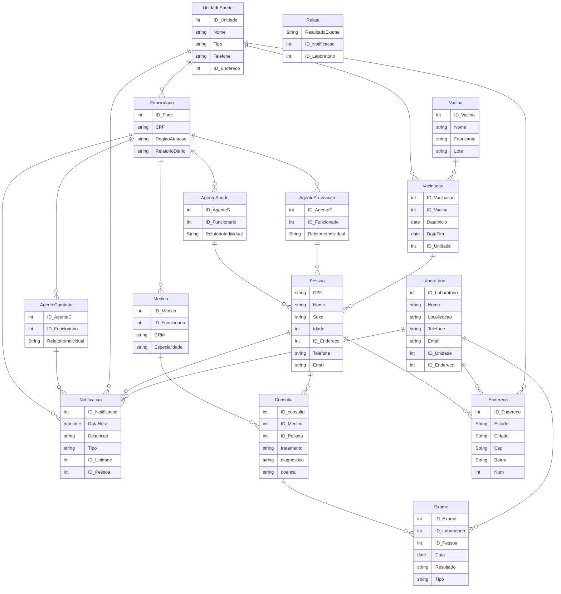

# Modelo Relacional do Sistema De Endemias

```mermaid
erDiagram
    Pessoa {
        string CPF
        string Nome
        string Sexo
        int Idade
        int ID_Endereco
        string Telefone
        string Email
    }

    UnidadeSaude {
        int ID_Unidade
        string Nome
        string Tipo
        string Telefone
        int ID_Endereco
    }

    Funcionario {
        int ID_Func
        string CPF
        string RegiaoAtuacao
        string RelatorioDiario
    }

    Medico {
        int ID_Medico
        int ID_Funcionario
        string CRM
        string Especialidade
    }

    AgenteSaude {
        int ID_AgenteS
        int ID_Funcionario
        String RelatorioIndividual
    }

    AgenteCombate {
        int ID_AgenteC
        int ID_Funcionario
        String RelatorioIndividual
    }

    AgentePrevencao {
        int ID_AgenteP
        int ID_Funcionario
        String RelatorioIndividual
    }

    Notificacao {
        int ID_Notificacao
        datetime DataHora
        string Descricao
        string Tipo
        int ID_Unidade
        int ID_Pessoa
    }

    Relata {
        String ResultadoExame
        int ID_Notificacao
        int ID_Laboratorio
    }

    Vacinacao {
        int ID_Vacinacao
        int ID_Vacina
        date DataInicio
        date DataFim
        int ID_Unidade
    }

    Vacina {
        int ID_Vacina
        string Nome
        string Fabricante
        string Lote
    }

    Laboratorio {
        int ID_Laboratorio
        string Nome
        string Localizacao
        string Telefone
        string Email
        int ID_Unidade
        int ID_Endereco
    }
    Consulta {
        int ID_consulta
        int ID_Medico
        int ID_Pessoa
        string tratamento
        string diagnostico
        string doenca
    }

    Exame {
        int ID_Exame
        int ID_Laboratorio
        int ID_Pessoa
        date Data
        string Resultado
        string Tipo
    }

    Endereco {
        int ID_Endereco
        String Estado
        String Cidade
        String Cep
        String Bairro
        int Num    
    }

    Funcionario ||--o{ Medico : ""
    Funcionario ||--o{ AgenteSaude : ""
    Funcionario ||--o{ AgentePrevencao : ""
    Funcionario ||--o{ AgenteCombate : ""
    Funcionario ||--o{ Notificacao : ""

    Medico ||--o{ Consulta : ""

    AgenteSaude ||--o{ Pessoa : ""
    AgentePrevencao ||--o{ Pessoa : ""
    AgenteCombate ||--o{ Notificacao : ""
    
    UnidadeSaude ||--o{ Funcionario : ""
    UnidadeSaude ||--o{ Notificacao : ""
    UnidadeSaude ||--o{ Vacinacao : ""

    Pessoa ||--o{ Notificacao : ""
    Consulta ||--o{ Exame : ""
    Pessoa ||--o{ Consulta : ""
    Pessoa ||--o{ Endereco : ""
    Laboratorio ||--o{ Endereco : ""
    UnidadeSaude ||--o{  Endereco: ""

    Vacinacao ||--o{ Pessoa : ""
    Vacina ||--o{ Vacinacao : ""
    
    Laboratorio ||--o{ Notificacao : ""
    Laboratorio ||--o{ Exame : ""
```
